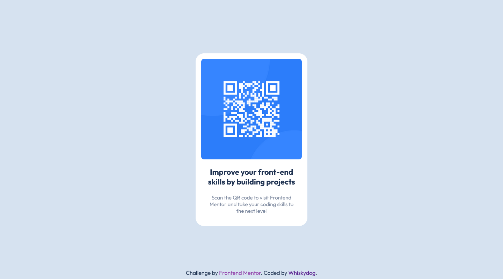

# Frontend Mentor - QR code component solution

This is a solution to the [QR code component challenge on Frontend Mentor](https://www.frontendmentor.io/challenges/qr-code-component-iux_sIO_H).

## Overview

### Screenshot

### Links

- Solution URL: [GitHub repository](https://github.com/Whiskydog/frontendmentor-qr-code)
- Live Site URL: [GitHub Pages site](https://whiskydog.github.io/frontendmentor-qr-code)

## Built with

- Semantic HTML5 markup
- CSS custom properties
- Flexbox

## Author

- Website - [Whiskydog GitHub Pages site](https://whiskydog.github.io)
- Frontend Mentor - [@Whiskydog](https://www.frontendmentor.io/profile/Whiskydog)
- Twitter - [@whiskydog](https://www.twitter.com/whiskydog)
